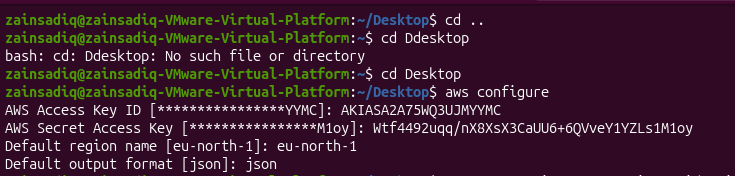
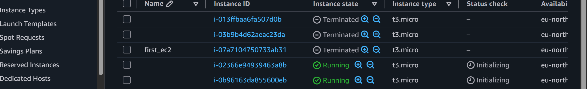
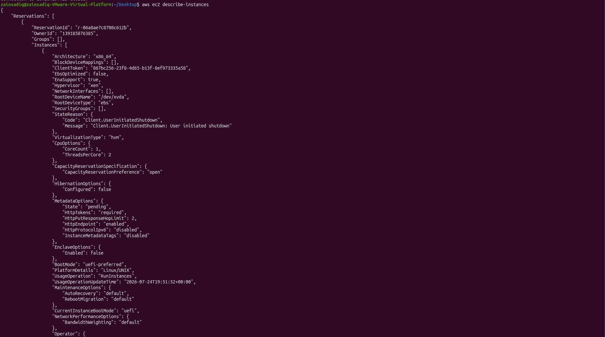
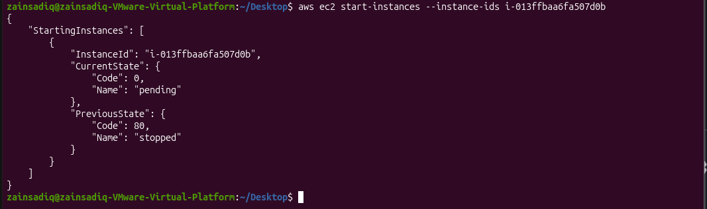
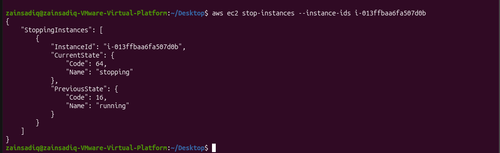
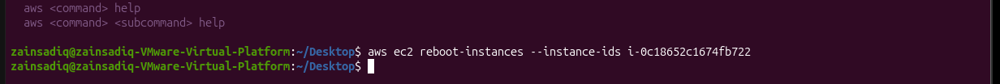
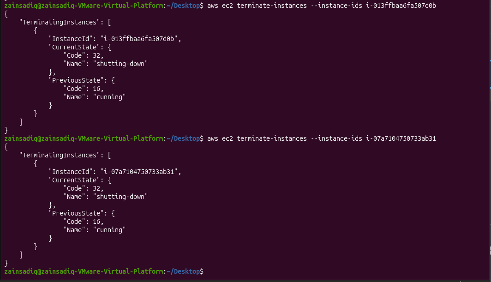
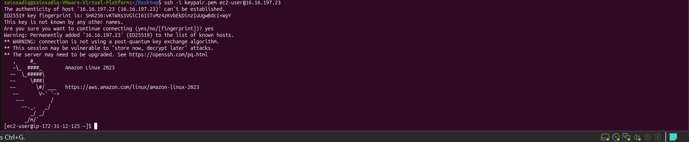

# AWS CLI EC2 Management

## Overview

This project demonstrates how to provision and manage an Amazon EC2 instance entirely using the AWS Command Line Interface (AWS CLI). It covers the complete lifecycle of an EC2 instance, from launching the instance to terminating it, while using SSH to securely connect and verify the deployment.

The goal of this project was to gain hands-on experience with AWS CLI commands and understand how to manage AWS resources without relying on the AWS Management Console.

---

## Objectives

* Configure the AWS CLI
* Launch an Amazon EC2 instance using the AWS CLI
* List existing EC2 instances
* Describe EC2 instance details
* Start and stop an EC2 instance
* Reboot an EC2 instance
* Terminate an EC2 instance
* Connect to the instance using SSH
* Verify the instance is running and accessible

---

## Technologies Used

* Amazon Web Services (AWS)
* Amazon EC2
* AWS CLI
* Amazon Linux
* Linux Command Line
* SSH

---

## Prerequisites

Before starting this project, ensure you have:

* An active AWS account
* AWS CLI installed
* AWS CLI configured using `aws configure`
* An EC2 key pair
* Appropriate IAM permissions to manage EC2 resources

---

## Project Workflow

1. Configure the AWS CLI credentials.
2. Launch an EC2 instance using the AWS CLI.
3. Verify the instance has been created.
4. Retrieve instance information.
5. Connect to the instance using SSH.
6. Manage the instance by stopping, starting, and rebooting it.
7. Terminate the instance after completing the exercise.

---

## AWS CLI Commands Used

### Configure AWS CLI

```bash
aws configure
```


### Launch an EC2 Instance

```bash
aws ec2 run-instances ...
```



### List EC2 Instances

```bash
aws ec2 describe-instances
```


### Start an Instance

```bash
aws ec2 start-instances --instance-ids <INSTANCE_ID>
```


### Stop an Instance

```bash
aws ec2 stop-instances --instance-ids <INSTANCE_ID>
```


### Reboot an Instance

```bash
aws ec2 reboot-instances --instance-ids <INSTANCE_ID>
```


### Terminate an Instance

```bash
aws ec2 terminate-instances --instance-ids <INSTANCE_ID>
```


### Connect via SSH

```bash
ssh -i <key-pair>.pem ec2-user@<PUBLIC_IP>
```

---


## Repository Structure

```text
aws-cli-ec2-management/
├── README.md
├── commands.md
└── screenshots/
```

---

## Screenshots

Include screenshots demonstrating:

* AWS CLI configuration
* Launching an EC2 instance
* Listing EC2 instances
* Describing the instance
* SSH connection
* Instance running in the AWS Console
* Start/Stop/Reboot operations
* Instance termination

---

## Skills Demonstrated

* AWS CLI
* EC2 Instance Management
* Linux Command Line
* SSH
* Cloud Infrastructure Basics

---

## Future Improvements

* Launch EC2 instances using a User Data script
* Manage Security Groups using the AWS CLI
* Allocate and associate an Elastic IP
* Automate the workflow with Bash scripts

---

## Author

**Zain Malik**

Learning AWS Cloud and Cloud Security through hands-on projects.
